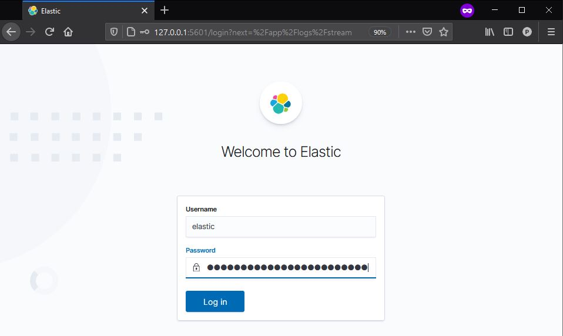
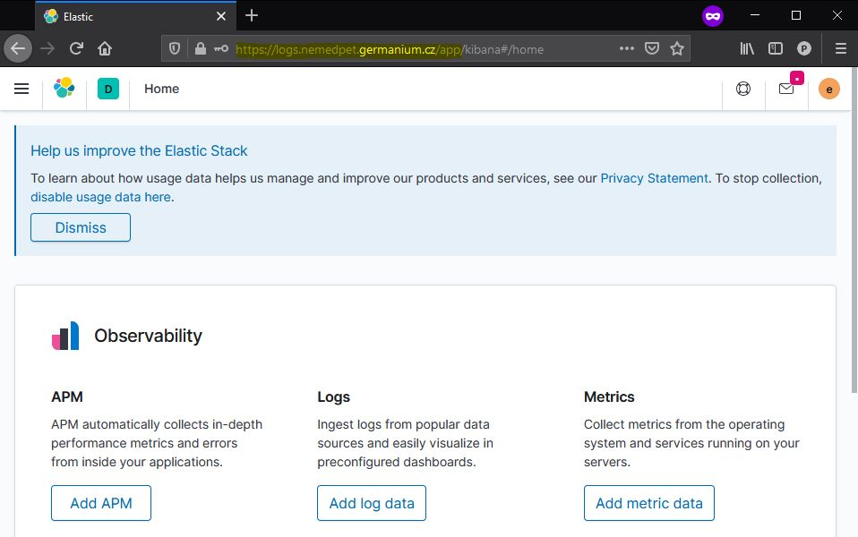
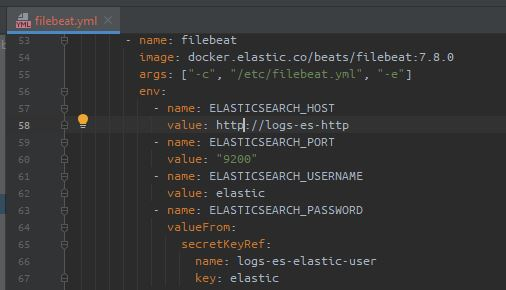
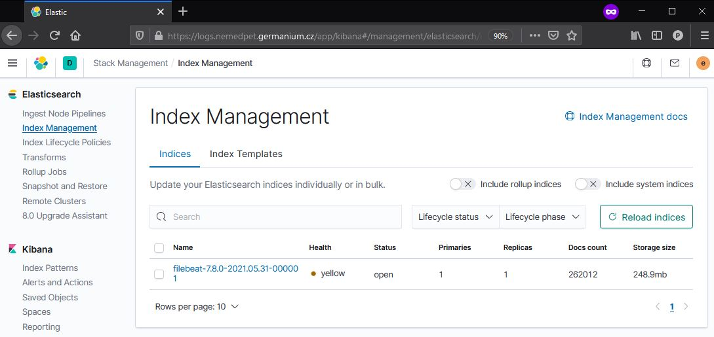
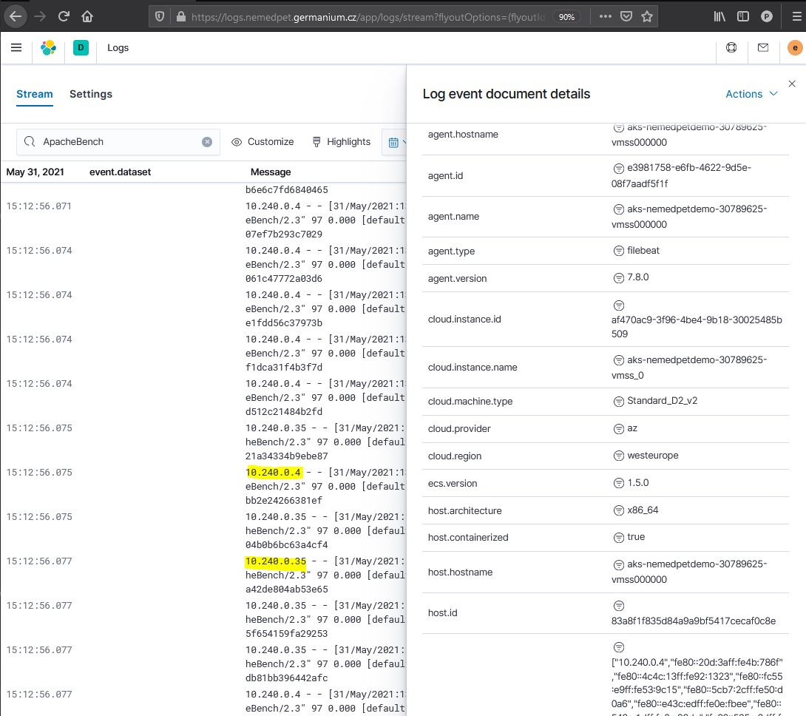
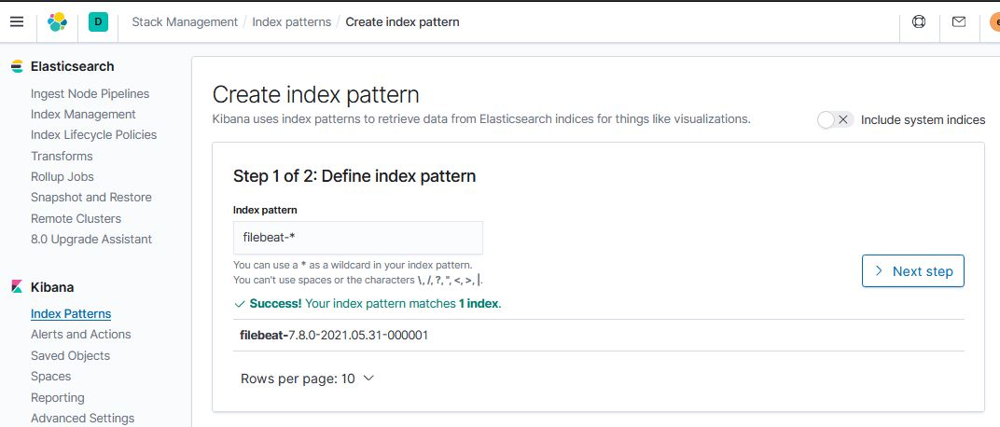
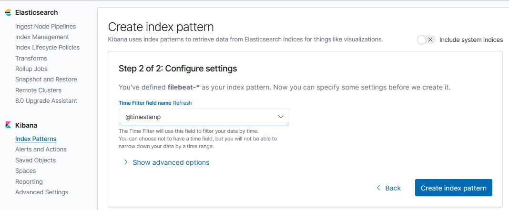

# Azure Kubernetes training

All instructions in this file are organized chronologically and walk you through the whole process of reproducing the kubernetes environment in Azure. That includes also
- Prometheus stack to scrap metrics from applications and k8s cluster
- Alert manager to send notifications
- Grafana to visualize metrics
- ELK Stack: Elasticsearch, Filebeat, Kibana for log management

## 01-Prerequisites
- terraform
- kubectl
- make
- Ubuntu VM on Windows (optional)

## 02-Deploy k8s cluster in AKS
New cluster will be deployed in AKS by deplpying pre-provisioned terraform module 

1. Clone the repository and copy terraform.tfvars.github to terraform.tfvars to store secret variables. Make sure terraform.tfvars is in .gitignore to prevent secure information from being pushed accidentally to repository
2. Generate new Cloudflare token at https://dash.cloudflare.com/profile/api-tokens and add it as a secret variable in terraform.tfvars
3. Add Cloudflare zone-id as a secret variable in terraform.tfvars
4. Update terraform variables, i.e. locals, location and node_count in variables.tf
5. Login to Azure in az cli
```shell
az login
az account set --subscription xxxxxxxxxxxxx (optional)
```

6. Deploy AKS cluster
Using the same shell logged in to az cli continue with terraform commands. 
```shell
terraform init
terraform apply
```
7. Check if the file kubeconfig has been created by terraform. Make sure it doesn't leak to github repository by ensuring it exists in .gitignore file. 
   
8. Update kubectl credentials.<br>
Preferably try to run Ubuntu VM on your windows workstations and create a symlink pointing to the directory shared with Windows
```shell
ln -s /mnt/c/Users/username/.............../azure-k8s/ azure-k8s
make kubeconfig-ubuntu
```
Or on windows workstation run a powershell scrip k8s-config.ps1 wrapped up in make
```shell
make kubeconfig-windows
```
To remove a symlink use the following command if needed.
```shell
unlink symlink_name
```
In case you already have multiple clusters in config file choose the right context
```shell
kubectl config get-contexts
kubectl config set-context
```

Check if the cluster is reachable, i.e.: 
```shell
kubectl get nodes
kubectl get pods -A 
```


## 03-Certification manager
The ingress controller that's going to be deployed in the next step will need a certificate for each ingress service. In this exercise the provider Let's Encypt is going to be used.
Navigate to the cert-manager directory.
```shell
cd cert-manager
make setup
make install
make apply-issuers
```

## 04-Ingress controller
Install nginx ingress controller and check the status.
Navigate to the ingress directory.
```shell
cd ingress
make setup
make install STATIC_IP=<IP address of LB> DNS_LABEL=nemedpet
make status
```
Deploy test apps apache and nginx and create ingress service for each of them
```shell
make webingress
make webservers:
```

Check if ingress services work in a web browser and what certificates are in use.
apache.<terraform locale>.<cloudflare domain>
nginx.<terraform locale>.<cloudflare domain>

### Video recording 

|  Note |  video file | time stamp |
|---|---|---|
| Makefile | recording 2/3 | 2:08:25 |
| Demo ingress wo SSL | recording 2/3 |2:38:48 |
| Demo ingress with SSL | recording 2/3 |3:55:50 | 


## 05-Maildev
Maildev is asimple SMTP server with web UI used for notifications when an alert occurs.  
It appers not to be able to forward email messages externally.
Navigate to the maildev_docker directory. 
```shell
cd maildev_docker
kubectl apply -f ns-maildev.yml
kubectl apply -f ingress-maildev-tls.yml
kubectl apply -f maildev.yml
```
We can't use Ondrej's Sika helm chart to deploy the maildev as the his setup is for different cloud provider using traefic ingress controller. He used another instance of maildev server already pre-provisioned running on panda-cluster.
### Video recording
|  Note |  video file | time |
|---|---|---|
| makefile maildev | recording 2/3 | 5:02:15 |
| maildev.sikademo.com 206.189.249.73 (panda-default cluster) | recording 2/3 | 6:17 |
| alertmanager-config.yml connected to 161.35.223.199:30025| recording 2/3 | 6:18:24|

## 06-Prometheus
Begin with deploying prometheus stack as described below and then follow the detailed description in the  file in the prometheus folder.

### Day2
Navigate to the prometheus directory and deploy prometheus stack.
```shell
cd prometheus
# Add Prometheus Helm repositoty
make helm
# Apply Prometheus CustomResourceDefinition
make crd
# Deploy Prometheus stack
# Update FQDN names of hosts in ingress.yml and alertmanager-config.yml before you continue
make prom
# Deploy example app and monitoring
make metric-example
```
### Day3
Advance configuration for alertmanager.


## 07-ECK

### Video recording 
|  Note |  video file | time |
|---|---|---|
|ELK| recording 3/3| 3:37|
|Elastic search operator | recording 3/3 | 3:38:21 |
|Filebeat - log processing tool | recording 3/3 | 4:08:40 |
|Index pattern| recording 3/3 |5:09:44|
|Create new dashboard| recording 3/3 |5:29:45|


Follow the steps described in https://github.com/ondrejsika/kubernetes-training#logging

### Setup ECK Operator
See the time stamp 3:41:10

```
kubectl apply -f https://download.elastic.co/downloads/eck/1.5.0/all-in-one.yaml
```

See logs (see the time stamp 3:41:35):

```
kubectl -n elastic-system logs -f statefulset.apps/elastic-operator
```

### Create Elastic Cluster

Setup `logs` namespace:

```
kubectl apply -f eck/ns.yml
```

Create Elasticsearch cluster (see the time stamp 3:45:19):

```
kubectl apply -f eck/elasticsearch.yml
```

Wait until `health=green`:

```
kubectl get -f eck/elasticsearch.yml
```

### Run Kibana

```
kubectl apply -f eck/kibana.yml
```

Wait until `health=green`:

```
kubectl get -f eck/kibana.yml
```

### Run Filebeat

```
kubectl apply -f eck/filebeat.yml
```

Wait until start:

```
kubectl get -f eck/filebeat.yml
```

See filebeat logs:

```
kubectl -n logs logs daemonset.apps/filebeat -f
```

### See Logs in Kibana

Get password for user `elastic`:

```
kubectl get -n logs secret logs-es-elastic-user -o=jsonpath='{.data.elastic}' | base64 --decode; echo
```

Run proxy to Kibana:

```
kubectl -n logs port-forward service/logs-kb-http 5601
```

See logs in Kibana (see the time stamp 3:52:45):
!!! Use HTTP rather that HTTPS as mentioned in the original documentations. 

<http://127.0.0.1:5601/app/logs/stream>



username: elastic
password: see the output of the previous command


### Ingress for logs
Deploy ingress service to access log management.

```
kubectl apply -f eck/ingress-elk-tls.yml
```

### Filebeat


Make sure using http instead of https in filebeat.yml manifest when defining ELASTICSEARCH_HOST variable (see the video recording at 4:13:45).



Check Indexes in Management > Stack Management > Index Management. There should be filebeat listed among the known indices known.


Check Observability > Logs

Filter out logs for traffic generated by apachebenchmark



### Demo loggen app
Deploy demo app to generate logs.
```
kubectl apply -f eck/ns-loggen.yml
kubectl apply -f eck/loggen.yml
```

### Define index pattern

Stack Management > Index patterns > Create index pattern
Define index pattern:
- step 1/2 - filebeat-*
- step 2/2 - @timestamp




Check Kibana > Discover
No streaming, logs have to be manually refreshed.
Choose interested fields from available labels to organize columns in the output.
Use for instance
- kubernetes.labels.app
- kubernetes.namespace
- kubernetes.pod.name
- messages

Use search bar to filter out logs e.g. kubernetes.labels.app :"loggen"
Save search

Create a new dashboard 
Kibana > Dashboard > Create new dashboard
Select Add panels, choose saved search from the previous step. 


## 08-Rancher

|  Note |  video file | time |
|---|---|---|
|Install Rancher| recording 3/3| 5:55:40 |

https://rancher.com/docs/rancher/v2.x/en/installation/install-rancher-on-k8s/#install-the-rancher-helm-chart

```
helm repo add rancher-latest https://releases.rancher.com/server-charts/latest
kubectl create namespace cattle-system
```
Update domain name and email and have rancher deployed.

```
helm install rancher rancher-latest/rancher \
  --namespace cattle-system \
  --set hostname=rancher.nemedpet.germanium.cz \
  --set ingress.tls.source=letsEncrypt \
  --set letsEncrypt.email=me@example.org
```
Access https://rancher.nemedpet.germanium.cz/
Change the password


## Appendix - useful links
Apache Benchmark - https://bobcares.com/blog/apache-benchmark-install-ubuntu/
Infracost - https://www.infracost.io/
netshoot: a Docker + Kubernetes network trouble-shooting swiss-army container - https://github.com/nicolaka/netshoot
bash auto-completion on Linux - https://kubernetes.io/docs/tasks/tools/included/optional-kubectl-configs-bash-linux/

