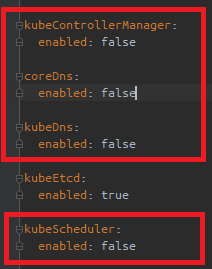
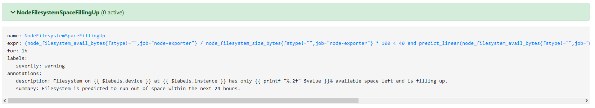

## Prometheus exercises (Day2)

### Demo app

Deploy demo web application and its monitoring

```shell
make metric-example
```
or 
```shell
kubectl apply -f example/app.yml
kubectl apply -f example/sm.yml
kubectl apply -f example/pr.yml
kubectl apply -f example/grafana-dashboard.yml
```
Description:
* sm.yml - Service monitor, defines which services will be collected by prometheus. You have to create a service point defined by the label.
* app.yml - Deploy simple web app. The port is named http, and the app label is metrics-example. 
* pr.yml - Define Prometheus rules to fire out some alerts.
* grafana-dashboard.yml - It creates the dashboard named "Example Dashboard" in grafana.


### Grafana account

Use the following credentials to log in to grafana.<br>
https://grafana.nemedpet.germanium.cz/

User: admin </br>
Password: prom-operator


### Prometheus metrics

Explore prometheus metrics. 
- example_requests
- sum(example_requests)
- rate(example_requests[1m])


### Exclude services managed by service provider in AKS from monitoring
(Video recording Day2 6:57-7:00)
There are a few metrics generating false positive alerts identified by prometheus.
To suppress the alerts set the variables listed below in the file [general.yml](https://github.com/germanium-git/azure-k8s/blob/master/prometheus/values/prom/general.yml) to false to prevent these metrics from being monitored by prometheus. 

- kubeControllerManager: false
- kubeScheduler: false
- coreDns: false
- kubeDns: false



And have the prometheus stack re-deployed again through make to make changes effective. 
```
make prom
```

### Watchdog
(Video recording Day2 7:03:30 - 7:04:20) 
It's always ON in Firing alerts. The purpose is to check if the whole monitoring stack is working.


### Node metrics
(Video recording Day2 7:06:35)
Explore **NodeFilesystemSpaceFillingUp** alert informing that file system runs out of space in 24 hours.



### All metrics 
(Video recording Day2 7:08)
Explore Globe button, metric explorer.

node_cpu_seconds_total

### Monitoring of the example app
Launch some requests by visiting the example app e.g. https://example.nemedpet.germanium.cz/

sum(rate(example_requests[1m]))*60

<a>
  
</a>


## Grafana 

### Troubleshooting

Note: There was an issue with dashboards not being loaded by grafana during the training. See the recording at 7:10:20.

The issue has been fixed by:
- Deleting grafana pod - see the recording at 7:14:17.
- Re-deploying prometheus stack by make prom - see the recording at 7:17
- All dashboards turn up in grafana - see the recording at 7:18:44 

When troubleshooting this type of issue check if all objects of the type ConfigMap have correct label grafana_dashboard=1. Mentioning of the need the label grafana_dashboard=1 to make grafana load the dashboard is in the recording at 7:12:30.
The ConfigMap is created through the manifest [grafana-dashboard.yml](https://github.com/germanium-git/azure-k8s/blob/master/prometheus/example/grafana-dashboard.yml)

```
kubectl get cm -A --show-labels
```

Check also logs of the container grafana-sc-dashboard in the pod grafana.
```
kubectl logs -n prometheus-stack prometheus-stack-grafana-68646f5dd-c5d2f grafana-sc-dashboard
```

Explore the dashboards.

### Monitoring ingress-nginx in grafana

Allow prometheus to grab metrics from nginx ingress.
Copy "controller.metrics.enabled and controller.metrics.serviceMonitor.enabled" from the ingress-nginx [helm chart](https://github.com/kubernetes/ingress-nginx/blob/master/charts/ingress-nginx/templates/controller-servicemonitor.yaml) to makefile (see the recording at 7:31:20).

Update the file [ingress/makefile](https://github.com/germanium-git/azure-k8s/blob/master/ingress/Makefile) to make prometheus monitor new ingress metrics after it's re-installed.
Uncomment the last two lines as these metrics are already in the comments.  

<a>
  
</a>

```
helm upgrade --install nginx-ingress ingress-nginx/ingress-nginx \
		...
		--set controller.metrics.enabled=true \
		--set controller.metrics.serviceMonitor.enabled=true
```


Go to ingress directory and get the ingress controller re-deployed to let prometheus monitor new ingress metrics.
```shell
cd ingress
make install STATIC_IP=<LB IP address> DNS_LABEL=<terraform locale>
```

Install dashboard for nginx ingress from the marketplace i.e. the [dashboard 9614](https://grafana.com/grafana/dashboards/9614)
Remember to choose prometheus as data source datasource when looking for another dashboard. 

<a>
  
</a>

Check service monitors if nginx-ingress is listed among them. 
```shell
kubectl get servicemonitors.monitoring.coreos.com -A
```

<a>
  
</a>


Check Targets and Servicediscovery in Prometheus whether the nginx ingres metrics have been discovered.

https://prometheus.nemedpet.germanium.cz/targets
https://prometheus.nemedpet.germanium.cz/service-discovery

<a>
  
</a>


## Prometheus exercises (Day3)

Deploy grafana dashboard for nginx from JSON.

https://github.com/kubernetes/ingress-nginx/blob/master/deploy/grafana/dashboards/nginx.json

Copy the file raw content and go to Grafana > dashboard > manage > Import > Import via panel JSON
Use and alternate name when and error with overlapping names and ID occurs. 
Note: The dashboard from marketplace uses the same name and ID as the one from JSON definition. 

Demonstrate the possibility of importing dashboards, and their customization through JSON in the ConfigMap manifest.
Modify the ConfigMap object example/grafana-dashboard.yml
Change time window from "now-30m" to "now-5m" and have the dashboard re-deployed. 
```shell
kubectl apply -f prometheus/example/
```


## Video recording Day2

Disclaimer: The video recording is not part of this repository as it's content is protected by copy right. It's been shared among group of people who have participated in the training and are authorised to use it. 
Here are some references to time stamps where main topics were presented during the training session during the Day 2/3.
Hope this helps to find out more information.

|  Note |  time |
|---|---|
|Prometheusstack introduction | 4:50:25|
|gitclone sikalabs/sikalabs-kubernetes-prometheus | 4:56:45|
|gitclone sika-training-examples/2021-04-19-tietoevry-k8s-prom | 4:59:24 |
|make crd |  5:03:30 |
|make copy-example-values|  5:05:10 |
|Login to grafana|   5:11:10 |
|Blank prometheus stack |  5:12:00 |
|Deployment of an example application |  5:13:00 | 
|Ingresses for example app & grafana & alertmanager |  5:42:00 |
|Example App - monitoring|  5:48:30|
|Example App - metrics |  5:49 |
|example_requests . 10 | recording 2/3| 5:42|
|Service monitor prometheus/example/sm.yml|  5:52:31|
|Prometheus rules prometheus/example/pm.yml | 5:54:18|
|maildev mail.os.cf01.eu | 6:01|
|smtp_from: monitoring-from@maildev.sikademo.com |6:07|
|Alertmanager - notify to email maildev.sikademo.com| 6:09|
|Outgoing email traffic| 6:17|
|rate(example_requests[1m]) | 6:21|
|Alertmanager - silence some alerts| 6:36|
|Alertmanager routes & receivers|6:39|
|Disable Default Prometheus Rules| 6:40:20|
|Monitor grafana prometeus/values/prom/general.yml|6:41|
|Tshoot of alerts detected by prometheus in k8s stack| 6:56|
|Enabling additional metrics in prometeus in general.yml|6:57|
|Stop monitoring services managed by service provider in AKS| 7:00|
|No dashboards in grafana| 7:10:20|
|Ingress-nginx monitoring in grafana| 7:26 |
|Grafana dashboard marketplace - nginx ingress|7:28 |
|Re-deploy prometheus stack to monitor nginx ingress metrics| 7:32| 
|Grafana dashboard for nginx ingress in the marketplace| 7:34:55 |
|Prometheus targets with new metrics for ingress |7:38:48|
|That's all for today :beers: :smile: | 7:39 |

### Video recording Day 3
|  Note |   time stamp |
|---|---|
| Alertmanager - routes for alerts |  ~ 1st hour |
| Alertmanager - multiple notifications routes| ~ 1st hour |
| Notification to Slack  | 1:14:30 |
| Nginx grafana dashboard from JSON | 1:47 |
| ConfigMap object example/grafana-dashboard.yml | 1:54:28|